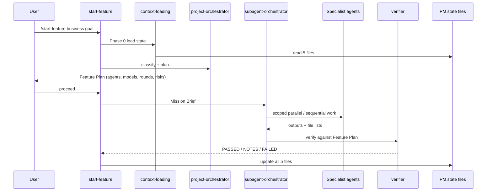

# How The AI Development System Works

## Purpose

This document explains the **operating model** of the AI development system used in this repository.

A bootstrap agent must understand this model before recreating it in another project.

The goal is to reproduce the **mechanism**, not to copy this project's e-commerce agents.

---

## One-Sentence Summary

A business goal enters through `/start-feature`, becomes a Feature Plan from a readonly orchestrator, waits for explicit `proceed`, is executed by scoped specialist subagents with cost-aware model routing, is validated by a skeptical verifier, and is recorded in shared project-management state.

---

## Layered Architecture

The system has six layers. Each layer has a different job. Do not merge them.

```text
┌─────────────────────────────────────────────────────────────┐
│ 1. USER INTENT                                              │
│    /start-feature <business goal>                           │
└───────────────────────────┬─────────────────────────────────┘
                            ▼
┌─────────────────────────────────────────────────────────────┐
│ 2. ENTRY SKILLS                                             │
│    context-loading → start-feature → subagent-orchestrator  │
└───────────────────────────┬─────────────────────────────────┘
                            ▼
┌─────────────────────────────────────────────────────────────┐
│ 3. ORCHESTRATION                                            │
│    project-orchestrator (readonly) → Feature Plan → proceed │
└───────────────────────────┬─────────────────────────────────┘
                            ▼
┌─────────────────────────────────────────────────────────────┐
│ 4. SPECIALIST AGENTS                                        │
│    domain agents created FROM skills + product logic        │
└───────────────────────────┬─────────────────────────────────┘
                            ▼
┌─────────────────────────────────────────────────────────────┐
│ 5. RULES + MCP + MODELS                                     │
│    constraints, tools, cost-aware model routing             │
└───────────────────────────┬─────────────────────────────────┘
                            ▼
┌─────────────────────────────────────────────────────────────┐
│ 6. PROJECT STATE + VERIFIER                                 │
│    PM files updated → verifier quality gate                 │
└─────────────────────────────────────────────────────────────┘
```

| Layer | What it is | What it is not |
|-------|------------|----------------|
| Rules (`.cursor/rules/`) | Mandatory constraints | Tutorials or workflows |
| Skills (`.cursor/skills/`) | How-to procedures | Agents or permanent roles |
| Agents (`.cursor/agents/`) | Specialists with role, model, scope | Dumping ground for all skills |
| Workflows (`.cursor/workflows/`) | Multi-phase process definitions | One-off chat prompts |
| Project management | Shared memory across sessions | Chat history |
| Model routing | Cost/quality policy | "Always use the strongest model" |

---

## Component Dictionary

### Rules

Rules answer: **"What must always be true?"**

Examples:

- planning before coding;
- DDD layer boundaries;
- PCI: never touch raw card data;
- update PM state after work.

Rules are selected by relevance (globs / task type). Do not load every rule into every agent.

### Skills

Skills answer: **"How do I do this class of work?"**

Examples:

- `start-feature` — entry workflow;
- `payment-integration` — payment provider integration steps;
- `postgresql` — schema design procedure;
- `subagent-orchestrator` — parallel execution procedure.

A skill is reusable knowledge. An agent is a role that is *allowed* to use a subset of skills.

### Agents / Subagents

Agents answer: **"Who owns this domain and under what constraints?"**

Each agent file in `.cursor/agents/` defines:

- `name`
- `description` (when Cursor should delegate)
- `model`
- `readonly` (true for planners/auditors)
- responsibilities
- allowed skills
- allowed rules
- allowed MCP
- file/domain scope
- escalation rules
- output format

**Critical rule:** agents are derived from product domains + selected skills. They are not a fixed universal roster.

### Workflows

Workflows answer: **"What is the ordered lifecycle?"**

Example: `feature-lifecycle.md` — context → plan → proceed → implement → test → verify → PM update.

### Project Management State

PM state answers: **"Where are we right now across sessions?"**

| File | Job |
|------|-----|
| `CURRENT_CONTEXT.md` | 30-second orientation |
| `PROJECT_STATUS.md` | phase, blockers, next actions |
| `TASKS.md` | master todo registry |
| `DECISIONS.md` | decision index + ADR links |
| `HANDOFF.md` | last session → next session transfer |

Without PM state, every new chat starts from zero and agents repeat or contradict prior work.

### Model Routing

Model routing answers: **"Which model is good enough and cheap enough for this step?"**

Default policy used by this bootstrap package:

| Model | Use |
|-------|-----|
| Composer 2.5 | implementation, tests, migrations, routine verification |
| Grok 4.5 / GPT-5.5 | planning, orchestration, research, docs, DevOps planning |
| Opus | architecture, security, payments, compliance, high-risk reasoning only |

### MCP

MCP answers: **"Which external tools are needed for this task?"**

Enable only required servers (Postgres, Playwright, Context7, GitHub, Docker, Memory, etc.). Do not enable everything by default.

### Hooks (optional but recommended)

Hooks remind agents to update PM state and can run lightweight post-edit quality checks.

---

## End-to-End Runtime Flow



### Phase details

1. **Context load** — read PM files + roadmap/decisions. Never skip.
2. **Goal assessment** — at most 2 clarifying questions if unclear.
3. **Complexity classification** — TRIVIAL / STANDARD / COMPLEX.
4. **Feature Plan** — orchestrator only; no application code.
5. **Proceed gate** — wait for `proceed` / `ok` / `yes` / `да` / equivalent.
6. **Mission Brief** — scoped packets: may read / may edit / must not edit.
7. **Execution rounds** — parallel when independent; sequential when dependent; no shared-file collisions.
8. **Sensitive review chain** (if auth/payments/PII) — domain hunter/reviewer agents before verifier.
9. **Verifier** — skeptical quality gate; readonly.
10. **PM update** — parent agent updates shared state; subagents do not own global PM writes unless assigned.

---

## Orchestrator Contract

`project-orchestrator` is the brain of feature intake.

It **must**:

- read PM state first;
- check decisions/ADRs for conflicts;
- classify complexity;
- select the smallest effective agent set;
- map skills to those agents intentionally;
- emit a Feature Plan with models and rounds;
- wait for user confirmation;
- never write application code.

It **must not**:

- implement features itself;
- assign the full roster by default;
- skip the proceed gate;
- create ADRs for trivial edits.

---

## Verifier Contract

`verifier` is the quality gate.

It **must**:

- compare claimed work to the Feature Plan;
- check code, tests, security-sensitive paths, docs, and PM freshness;
- report `PASSED` / `PASSED WITH NOTES` / `FAILED`;
- remain readonly.

A feature is not done until verifier passes (or passes with notes that do not block release).

---

## Skills vs Agents (do not confuse)

| Concept | Lifecycle | Example |
|---------|-----------|---------|
| Skill | Procedure you load when needed | `payment-integration` |
| Agent | Persistent role with model + scope | `checkout-specialist` |

Correct relationship:

```text
Product domains
    +
Selected skills from inventory
    =
Project-specific agents
```

Incorrect relationship:

```text
Copy all agents from another repo
    +
Attach all skills to every agent
    =
Broken / expensive / generic system
```

The mandatory algorithm for building agents from skills is in `SKILLS-TO-AGENTS-PIPELINE.md`.

---

## Feature Plan Minimum Fields

Every Feature Plan must include:

1. Feature name
2. Complexity
3. ADR required yes/no + reason
4. Domains affected
5. Agent assignment (scoped tasks)
6. Model strategy
7. Execution rounds
8. Risks + mitigations
9. Validation steps
10. Estimated effort

If any of these are missing, the plan is incomplete.

---

## Mission Brief Minimum Fields

After `proceed`, each subagent receives:

- goal
- agent id / role
- model
- allowed skills
- allowed rules
- MCP/tools
- may read
- may edit
- must not edit
- depends on
- expected output
- validation

---

## Cost And Escalation Philosophy

1. Prefer the cheapest model that can do the job.
2. Plan on Grok/GPT-class models.
3. Build on Composer-class models.
4. Escalate to Opus only for architecture / security / payments / compliance / repeated deep failure.
5. After planning, downgrade routine implementation back to Composer.

---

## What "The Same System" Means In A New Project

Same:

- layered structure (rules / skills / agents / workflows / PM / routing);
- `/start-feature` → Feature Plan → `proceed` → specialists → verifier → PM update;
- skills inventory before agent creation;
- project-specific agent roster;
- cost-aware model routing;
- file ownership and collision prevention.

Different (must be adapted):

- domain agent names;
- which skills are selected;
- which MCP servers matter;
- quality gate checklist items;
- domain rules (PCI, HIPAA, booking, CRM, etc.);
- stack-specific paths (`apps/web`, `ios/`, `services/`, …).

---

## Anti-Patterns

- Coding before Feature Plan approval
- Creating agents before reading the skills folder
- Creating agents that another project had "just in case"
- Assigning all skills to all agents
- Using Opus for CRUD and routine verification
- Letting parallel agents edit the same file
- Treating chat history as project memory instead of PM files
- Making the orchestrator write application code
- Marking work done without verifier evidence

---

## Related Documents

| Doc | Role |
|-----|------|
| `SKILLS-TO-AGENTS-PIPELINE.md` | Mandatory skills inventory → agent design |
| `REFERENCE-IMPLEMENTATION.md` | How this repo applies the model |
| `AGENT-SYSTEM-SPEC.md` | Target structure to generate |
| `START-FEATURE-WORKFLOW.md` | `/start-feature` contract |
| `MODEL-ROUTING.md` | Model policy |
| `PROJECT-PLANNING-AND-COORDINATION.md` | Roadmap, todos, ownership |
| `BOOTSTRAP-PROMPT.md` | Prompt to run in a new project |
| `VALIDATION-CHECKLIST.md` | Acceptance checks |
