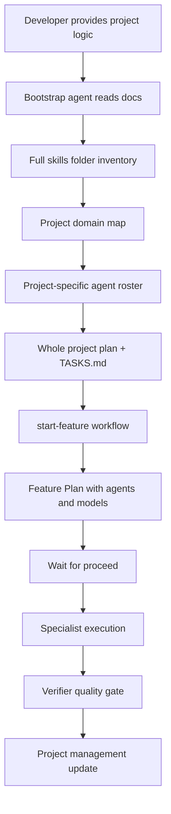

# AI Agent System Bootstrap

## Purpose

Portable package for recreating an AI-assisted development system in **any** software project.

An agent that reads this folder must be able to build:

- rules, skills, specialist agents;
- `project-orchestrator` + `verifier`;
- `/start-feature` with Feature Plan + explicit `proceed`;
- subagent execution with file ownership;
- project-management state;
- whole-project plan + shared todo registry;
- model routing;
- validation and handoff protocols.

**Critical:** do **not** copy ecommerce agents from this repository.
Run the skills inventory and create specialists for **the target project's** domains.
See `SKILLS-TO-AGENTS-PIPELINE.md`.

---

## Для разработчика (кратко)

Эта папка — инструкция, по которой другой агент может **собрать такую же ИИ-систему** в новом проекте:

1. читает логику продукта;
2. **полностью анализирует папку skills**;
3. строит карту доменов;
4. создаёт субагентов **только под этот проект**;
5. ставит `/start-feature` → план → `proceed` → специалисты → verifier → PM-файлы.

Не копируйте `checkout-specialist` / `catalog-specialist` «на всякий случай». Их заменяют агенты вашего домена (например `booking-specialist`, `crm-specialist`).

---

## When To Use

- websites, SaaS, mobile, APIs, admin panels;
- marketplaces, ecommerce, CRM/ERP;
- AI products, internal business tools;
- any greenfield or early-stage repo that needs disciplined multi-agent delivery.

---

## Required Inputs

1. Application logic / product brief
2. Project folder (with or without existing skills)
3. Existing rules/docs/constraints if any
4. Preferred stack if known

---

## Recommended Reading Order (for the bootstrap agent)

Read **in this order**:

| # | File | Why |
|---|------|-----|
| 1 | `README.md` | Orientation |
| 2 | `HOW-THE-SYSTEM-WORKS.md` | Mechanism: layers, flows, contracts |
| 3 | `SKILLS-TO-AGENTS-PIPELINE.md` | **Mandatory** skills inventory → project agents |
| 4 | `REFERENCE-IMPLEMENTATION.md` | Worked example from this ecommerce repo |
| 5 | `BOOTSTRAP-PROMPT.md` | Prompt to execute |
| 6 | `AGENT-SYSTEM-SPEC.md` | Target file structure and agent shape |
| 7 | `PROJECT-PLANNING-AND-COORDINATION.md` | Roadmap, todos, ownership, handoffs |
| 8 | `START-FEATURE-WORKFLOW.md` | `/start-feature` contract |
| 9 | `MODEL-ROUTING.md` | Cost-aware model policy |
| 10 | `TEMPLATES.md` | File templates |
| 11 | `VALIDATION-CHECKLIST.md` | Acceptance gate |

Attach the whole folder to the agent. Paste the product brief into the prompt from `BOOTSTRAP-PROMPT.md`.

---

## Expected Result



---

## Non-Negotiable Behaviors

- Inspect the **full** skills folder before creating agents (`SKILLS-TO-AGENTS-PIPELINE.md`).
- Produce a Skills→Agents Report before writing domain agent files.
- Do not create agents "just in case" from another project.
- `project-orchestrator` is readonly and never writes application code.
- `verifier` is readonly and skeptical.
- `/start-feature` produces a Feature Plan and waits for explicit `proceed`.
- Every Feature Plan lists agents, models, rounds, risks, validation.
- Project state lives in `.cursor/project-management/`.
- Parallel agents must not edit the same files without serialized ownership.

---

## Minimal System

Every generated project needs at least:

- `.cursor/agents/project-orchestrator.md`
- `.cursor/agents/verifier.md`
- `.cursor/skills/context-loading/SKILL.md`
- `.cursor/skills/start-feature/SKILL.md`
- `.cursor/skills/subagent-orchestrator/SKILL.md`
- `.cursor/workflows/feature-lifecycle.md`
- `PROJECT_ROADMAP.md` or `docs/PROJECT_PLAN.md`
- `.cursor/project-management/{CURRENT_CONTEXT,PROJECT_STATUS,TASKS,DECISIONS,HANDOFF}.md`
- `docs/MASTER-AI-WORKFLOW.md`

Additional agents only after domain + skills analysis.

---

## First Command After Bootstrap

```text
/start-feature [business feature]
```

The orchestrator must show a plan and wait for `proceed` before implementation.

---

## Package Index

| File | Role |
|------|------|
| `HOW-THE-SYSTEM-WORKS.md` | System anatomy and runtime flow |
| `SKILLS-TO-AGENTS-PIPELINE.md` | Mandatory skills→agents design process |
| `REFERENCE-IMPLEMENTATION.md` | How this ecommerce repo applies the model |
| `BOOTSTRAP-PROMPT.md` | Copy-paste prompt for a new project |
| `AGENT-SYSTEM-SPEC.md` | Spec of generated components |
| `PROJECT-PLANNING-AND-COORDINATION.md` | Roadmap + coordination rules |
| `START-FEATURE-WORKFLOW.md` | Feature entry workflow |
| `MODEL-ROUTING.md` | Model selection policy |
| `TEMPLATES.md` | Generators for files |
| `VALIDATION-CHECKLIST.md` | Done criteria for bootstrap |
