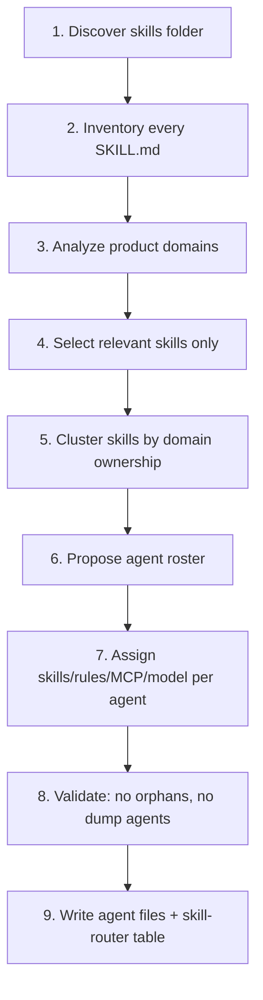

# Skills → Agents Pipeline (Mandatory)

## Purpose

This is the **non-negotiable** process for creating specialist subagents in a new project.

The bootstrap agent must:

1. fully inventory the available skills;
2. analyze the product domain;
3. select only relevant skills;
4. **derive** agents from that analysis;
5. map skills → agents intentionally.

Copying another project's agent roster without this pipeline is a failure.

---

## Core Principle

```text
Skills describe HOW to work.
Agents describe WHO owns a domain and WHICH skills they may use.

Agents are outputs of analysis.
Skills are inputs to analysis.
```

Never invent agents first and then hunt for skills to justify them.

Never attach every skill to every agent.

---

## Mandatory Pipeline



Skip any step → invalid bootstrap.

---

## Step 1 — Discover Skills

Search the project for skill definitions. Typical locations:

```text
.cursor/skills/**/SKILL.md
skills/**/SKILL.md
.claude/skills/**/SKILL.md
docs/skills/**
```

Also read any manifest if present (`docs/SKILL-MANIFEST.md`, `skills/README.md`).

Record:

- absolute/relative path;
- whether the skill is installed in the active agent environment;
- whether it is domain-specific or meta (orchestration / routing / context).

---

## Step 2 — Build Full Skills Inventory

For **every** skill found, create one inventory row. Do not skim filenames only. Read each relevant `SKILL.md` frontmatter + purpose/when-to-use sections.

### Inventory schema

```md
| Skill | Purpose | When to use | Domains | Risk level | Keep? | Candidate agents |
|-------|---------|-------------|---------|------------|-------|------------------|
| payment-integration | Provider checkout + webhooks | Payments work | checkout, billing | high | yes | payments-specialist |
| shadcn | UI components | Frontend UI | frontend | low | yes | frontend-engineer |
| returns-reverse-logistics | Returns flows | Returns domain | logistics | medium | no* | — |
```

\* `no` means: not relevant to **this** product logic, even if the skill exists in the folder.

### Required fields per skill

```text
Skill:
Path:
Purpose:
When to use:
When NOT to use:
Supported domains:
Inputs required:
Outputs produced:
Risk / compliance notes:
Keep for this project: YES | NO
Reason:
Suggested owning agent(s):
Notes:
```

### Meta skills (almost always keep)

These are mechanism skills, not domain skills:

| Skill | Why keep |
|-------|----------|
| `context-loading` | mandatory pre-work state load |
| `start-feature` | entry workflow |
| `subagent-orchestrator` | parallel execution |
| `model-routing` | cost/quality routing |
| `skill-router` | help humans/agents pick skills |
| `architecture-decision-records` | if architecture changes are expected |
| `code-review-checklist` | verifier support |

---

## Step 3 — Analyze Product Domains

Independently of skills, extract the project's real domains from the product brief and repo.

Ask:

1. What are the core business objects?
2. What are the primary user journeys?
3. What admin/backoffice journeys exist?
4. What external systems are integrated?
5. Where is money, identity, PII, health, or safety involved?
6. What technical layers exist (web, API, DB, mobile, data, infra)?

Produce a domain map:

```md
## Domain Map

| Domain | Why it exists in THIS product | Criticality | Needs specialist agent? |
|--------|-------------------------------|-------------|-------------------------|
| Catalog | Core storefront products | high | yes |
| Checkout | Money movement | critical | yes |
| Auth | Accounts / sessions | high | maybe security-auditor + backend |
| SEO | Public pages | medium | skill only, maybe no agent |
| Returns | Not in MVP | low | no |
```

Rules of thumb:

- **Critical / high + recurring work** → specialist agent
- **Medium + occasional** → skill used by a stack agent (frontend/backend)
- **Low / out of scope** → do not create an agent; optionally omit skill from router

---

## Step 4 — Select Skills

Intersect inventory with domain map.

Keep a skill if **any** of these is true:

- required by a core domain;
- required by a compliance/risk area;
- required by the orchestration mechanism;
- clearly useful in the next 1–2 milestones.

Drop or defer a skill if:

- it belongs to a domain the product does not have;
- it duplicates a stronger selected skill;
- it would tempt agents into out-of-scope work.

Output:

```text
SELECTED SKILLS (N)
DEFERRED SKILLS (N)
REJECTED SKILLS (N) — with one-line reason each
```

---

## Step 5 — Cluster Skills Into Ownership Groups

Group selected skills by who should own them.

Example clustering method:

```text
Cluster A — Frontend surface
  shadcn, nextjs-app-router-patterns, zustand-store-ts, zod-validation-expert

Cluster B — Backend/API
  python-fastapi-development, fastapi-pro, openapi-spec-generator

Cluster C — Data
  postgresql, postgresql-optimization

Cluster D — Payments
  payment-integration, pci-compliance, implement-checkout-flow

Cluster E — Quality
  e2e-testing, code-review-checklist, cc-skill-security-review

Cluster F — Mechanism
  start-feature, context-loading, subagent-orchestrator, model-routing
```

Clustering rules:

- One cluster → usually one agent.
- Two tightly coupled clusters with the same owner → one agent.
- A high-risk cluster (payments, clinical, identity) → dedicated specialist even if small.
- Mechanism cluster → orchestrator/verifier skills, not a "meta-agent" that writes product code.

---

## Step 6 — Propose Agent Roster

Always create:

1. `project-orchestrator` (readonly, planner)
2. `verifier` (readonly, quality gate)

Then create domain/stack agents **only from clusters that survived Step 5**.

### Decision table

| If domain map shows… | Create agent… | Default model |
|----------------------|---------------|---------------|
| Web UI work | `frontend-engineer` | Composer 2.5 |
| Backend services | `backend-engineer` | Composer 2.5 |
| Schema/migrations | `database-engineer` | Composer 2.5 |
| Public API contracts | `api-engineer` | Composer 2.5 |
| E2E/regression | `qa-engineer` | Composer 2.5 |
| CI/CD/Docker | `devops-engineer` | Grok 4.5 / GPT-5.5 |
| Auth/PII/OWASP | `security-auditor` | Opus (readonly) |
| Architecture/ADR needs | `enterprise-architect` or `system-architect` | Opus (readonly) |
| Payments/billing | `payments-specialist` / project-named specialist | Opus |
| Product-specific domain (booking, CRM, LMS, IoT…) | `[domain]-specialist` named in product language | by risk |

### Naming rule

Name agents after **this product's language**.

Examples:

| Product | Good name | Bad name |
|---------|-----------|----------|
| Clinic booking | `booking-specialist` | `checkout-specialist` |
| B2B CRM | `pipeline-specialist` | `catalog-specialist` |
| Fitness app | `workout-specialist` | `learning-specialist` |
| This ecommerce repo | `checkout-specialist`, `catalog-specialist` | `misc-agent` |

---

## Step 7 — Map Skills / Rules / MCP / Models Per Agent

For each agent, fill:

```md
### Agent: checkout-specialist
Model: claude-opus-4-8-thinking-high
Readonly: false
Owns domains: checkout, payments, orders
May edit: apps/api/.../checkout, apps/web/.../checkout, payment adapters
Must not edit: unrelated catalog admin, infra-wide refactors
Allowed skills:
- payment-integration — provider + webhooks
- implement-checkout-flow — end-to-end checkout procedure
- pci-compliance — PCI boundaries
Allowed rules:
- ecommerce/checkout, ecommerce/payments, security/pci
Allowed MCP:
- PostgreSQL, OpenAPI
Escalation:
- architecture changes → enterprise-architect
- raw card data design smell → security-auditor immediately
```

### Mapping constraints

- Max useful skills per agent: typically 3–7.
- Verifier gets review/testing skills, not implementation domain dumps.
- Orchestrator gets mechanism/planning skills only.
- High-risk agents may get fewer skills, but stricter rules.

### Build the project skill-router table

After mapping, generate routing rows:

```md
| Goal | Primary skill | Secondary | Agent | Model |
|------|---------------|-----------|-------|-------|
| Add payment provider | payment-integration | pci-compliance | payments-specialist | Opus |
| New UI page | shadcn | nextjs-app-router-patterns | frontend-engineer | Composer 2.5 |
```

This becomes `.cursor/skills/skill-router/SKILL.md` content for the new project.

---

## Step 8 — Validate The Roster

Pass all checks:

- [ ] Every selected high/critical domain has an owner agent or an explicit "owned by stack agent" note
- [ ] Every selected skill is assigned to ≥1 agent **or** marked as on-demand utility with no permanent owner
- [ ] No agent has all skills
- [ ] No agent exists without at least one justifying domain or skill cluster
- [ ] Orchestrator and verifier are readonly
- [ ] Payments/auth/PII domains have Opus or explicit high-risk routing
- [ ] Agent names match product language
- [ ] Parallel-file collision policy is documented for overlapping domains

### Failure examples

| Failure | Why invalid |
|---------|-------------|
| Created `catalog-specialist` for a CRM with no catalog | Copied from ecommerce reference |
| Assigned 40 skills to `backend-engineer` | No intentional mapping |
| Skipped reading `SKILL.md` bodies | Filename-only inventory |
| Created `button-agent` | Too granular; not a domain |
| No verifier | Missing quality gate |
| Orchestrator writes code | Breaks planning gate |

---

## Step 9 — Write Artifacts

Only after validation, write:

1. `.cursor/agents/*.md` for approved agents
2. `.cursor/agents/README.md` index with model + domain table
3. `.cursor/skills/skill-router/SKILL.md` with project routing table
4. `docs/SKILL-MANIFEST.md` (or equivalent) listing selected skills
5. Section in `docs/MASTER-AI-WORKFLOW.md` describing the roster
6. Bootstrap report including inventory summary

---

## Worked Example A — Ecommerce (this repository)

### Product domains

Catalog, checkout/payments, auth, admin, SEO, DevOps.

### Skills kept (sample)

`implement-catalog-feature`, `implement-checkout-flow`, `payment-integration`, `pci-compliance`, `postgresql`, `nextjs-*`, `fastapi-*`, `playwright-e2e-checkout`, mechanism skills…

### Agents derived

| Agent | Derived from skills/domains |
|-------|-----------------------------|
| `catalog-specialist` | catalog skills + product/category domain |
| `checkout-specialist` | checkout/payment/PCI skills + money domain |
| `backend-engineer` | FastAPI skills |
| `frontend-engineer` | Next.js/shadcn skills |
| `database-engineer` | PostgreSQL skills |
| `security-auditor` | security/PCI review skills |
| `qa-engineer` | e2e skills |
| `silent-failure-hunter` / `diff-reviewer` | quality skills for payment/auth risk paths |
| `project-orchestrator` / `verifier` | mechanism |

Rejected example: do **not** create a `learning-specialist` just because an LMS skill exists in a shared pack.

---

## Worked Example B — Clinic Booking SaaS

### Product domains

Patients, clinicians, appointments, reminders, payments for visits, admin schedule.

### Skills inventory outcome (illustrative)

| Skill | Keep? | Why |
|-------|-------|-----|
| `payment-integration` | yes | visit payments |
| `pci-compliance` | yes | card payments |
| `implement-catalog-feature` | no | no product catalog |
| `returns-reverse-logistics` | no | no retail returns |
| `postgresql` | yes | scheduling data |
| `shadcn` / `nextjs-*` | yes | web app |
| `e2e-testing` | yes | booking flows |

### Agents derived (illustrative)

- `project-orchestrator`
- `verifier`
- `frontend-engineer`
- `backend-engineer`
- `database-engineer`
- `booking-specialist` ← created because appointment domain is core
- `payments-specialist` ← because money moves
- `security-auditor` ← PII/health-adjacent data
- `qa-engineer`
- `devops-engineer`

Not created: `catalog-specialist`, `checkout-specialist` (unless the product literally uses checkout language).

---

## Worked Example C — Marketing Website Only

### Domains

Pages, CMS content, SEO, forms, deploy.

### Agents derived

- `project-orchestrator`
- `verifier`
- `frontend-engineer`
- `seo-specialist` (if SEO skills are central)
- `qa-engineer`
- `devops-engineer`

Not created: database/payments/catalog agents unless the site grows into an app.

---

## Output Template: Skills→Agents Report

The bootstrap agent must return this report before writing agent files (or include it in the final bootstrap report):

```text
SKILLS → AGENTS REPORT
─────────────────────────────────────────
Skills discovered: [N]
Skills read: [N]
Skills selected: [list]
Skills deferred: [list]
Skills rejected: [list + reasons]

Domain map:
- [domain]: criticality=[..] agent=[yes/no → name]

Clusters:
- [cluster]: skills=[..] → agent=[name] model=[..]

Agent roster:
- project-orchestrator (required)
- verifier (required)
- [domain agents...]

Skill coverage:
- unassigned selected skills: [none | list]
- overloaded agents (>7 skills): [none | list]

Validation: PASS | FAIL
─────────────────────────────────────────
```

---

## Anti-Patterns (explicit)

1. **Roster cloning** — copying ecommerce agents into a non-ecommerce app.
2. **Filename inventory** — deciding from skill folder names without reading `SKILL.md`.
3. **Skill hoarding** — keeping every imported skill "for later" and wiring all of them into agents.
4. **Everything-agent** — one agent allowed to use all skills.
5. **Micro-agents** — one agent per button/component.
6. **Skills after agents** — creating agents first, then searching for skills to attach.
7. **No product analysis** — designing the roster from stack alone (`frontend`, `backend`) while ignoring business domains that need specialists.

---

## Relationship To Other Docs

| Doc | Uses this pipeline how |
|-----|------------------------|
| `BOOTSTRAP-PROMPT.md` | Enforces Steps 1–9 in the prompt |
| `AGENT-SYSTEM-SPEC.md` | Defines agent file shape after roster is chosen |
| `HOW-THE-SYSTEM-WORKS.md` | Explains why skills and agents are different layers |
| `VALIDATION-CHECKLIST.md` | Checks that inventory and mapping were done |
| `REFERENCE-IMPLEMENTATION.md` | Shows one valid outcome for this ecommerce repo |
