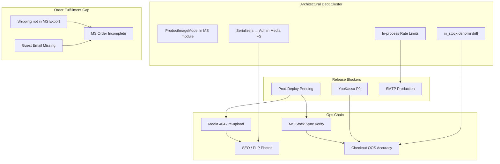

# Комплексный аудит интернет-магазина «СУХОПУТ»

**Дата:** 2026-07-23  
**Метод:** 10 параллельных специализированных агентов → синтез orchestrator  
**Базовый обзор:** full project review 2026-07-21 (зафиксирован в `PROJECT_STATUS.md` / PM history; delta-фокус на изменениях 22–23.07)  
**Режим:** read-only audit, код не изменялся

---

## 1. Executive Summary

| Метрика | Оценка | Комментарий |
|---------|--------|-------------|
| **Функциональная готовность** | ~92% | Catalog, checkout stub, admin Waves 8–14, MS integration |
| **Production-ready (business)** | ~60% | Блокер: YooKassa + ops gaps |
| **Архитектура** | ~85% | Modular monolith зрелый; boundary leaks catalog↔MS |
| **Безопасность** | ~75% | Admin hardening хорош; customer rate limits + JWT revocation — нет |
| **Тестирование** | ~70% dev / ~55% release | 254 pytest, ~61 E2E; YooKassa/prod smoke отсутствуют |
| **SEO / discoverability** | ~40% | Нет sitemap, canonical, OG |
| **DevOps** | ~70% | Docker/Caddy OK; deploy не gated CI, backup runbook нет |

**Главный вывод:** кодовая база зрелая и хорошо структурирована. Разрыв между **code-ready** и **production-ready** — операционный (deploy pending fixes, media re-upload, MS stock verify) и бизнес-блокер (YooKassa, SMTP, реальная фотосъёмка).

---

## 2. Cross-Cutting Themes (взаимосвязи проблем)



### Theme A — «Code vs Prod» (критическая цепочка)

**Связанные findings:** catalog P0-1/2/3, devops deploy, HANDOFF pending deploy.

Фиксы 22–23.07 (media upload, MS stock sync, admin MS save, PLP gallery) **готовы в коде, но не на prod**. Это усиливает:
- PLP placeholder вместо gallery (→ SEO, conversion)
- Admin «0 шт.» по MS stock (→ неверный OOS на витрине)
- Gallery 404 после media-bug (→ merchandising блокеры)

**Единое действие:** один deploy + ops verification checklist (см. Wave 0).

### Theme B — Payment & Fulfillment (release gate)

**Связанные findings:** checkout P0-1/2/3/4, security PCI, frontend P0-3, qa P0-1, api-engineer webhook schema.

YooKassa отсутствует → checkout UI, CSP, webhooks, DB columns, tests — всё на Stripe/stub. Параллельно:
- Guest checkout создаёт заказы **без email** → MS export падает
- Shipping сохраняется в DB, но **не экспортируется в MS** и **не виден покупателю** в ЛК

**Единое действие:** YooKassa sprint + fulfillment hardening (guest email, shipping export) — Wave 1.

### Theme C — Stock Truth (рассинхронизация данных)

**Связанные findings:** database P1-3/4, checkout P1-8, catalog P1-2, MS sync.

Три источника «остатка»:
1. `inventory_items` (authoritative для checkout)
2. `products.in_stock` / `variants.in_stock` (denorm, обновляется MS sync, **не** после deduct)
3. Storefront threshold `< 3` (только в MS apply_stock)

**Impact:** PLP filter «в наличии» врёт после покупки; cart может пропустить/заблокировать при расхождении boolean vs quantity.

**Единое действие:** единая функция availability + sync `in_stock` после deduct (Wave 2).

### Theme D — Boundary Leaks (catalog ↔ integrations)

**Связанные findings:** architect P0-2/3/5/6/7, backend P1-7, catalog P1-1, database P1-7, api P1-5.

Кластер связанных проблем:
- `ProductImageModel` в moysklad module (4 агента согласны)
- `serializers.py` → `admin/infrastructure/media` (FS stat на PLP hot path)
- `storefront_visibility.py` → SQLAlchemy в domain
- Catalog router → MS HTTP client для erp-image proxy

**Единое действие:** catalog boundary cleanup sprint (Wave 2).

### Theme E — Security & Scale (multi-replica)

**Связанные findings:** security P0-2, backend P0-2, architect P1-11/10, database P0-1, checkout P1-10.

Общий корень: **in-process** rate limits + background jobs (sweep, bulk jobs, MS cron) без leader election.

**Единое действие:** document single-replica constraint (short-term) → Redis limiter + sweep locking (Wave 2–3).

### Theme F — Contract & Frontend Type Safety

**Связанные findings:** api-engineer P1-1/2/3, backend P1-6, frontend P1-5, qa P1-5.

OpenAPI описывает в основном 2xx; frontend — hand-written fetch без codegen; нет vitest.

**Единое действие:** ErrorResponse schema + openapi-typescript (Wave 3).

---

## 3. Resolved Contradictions

| Противоречие | Resolution |
|--------------|------------|
| Production-ready % (55–85%) | **Functional ~92%, business release ~60%**. Разные агенты оценивали разные слои. Release gate = YooKassa + ops. |
| pytest count 213 vs 254 | **254** — актуально (QA audit, +41 с 21.07) |
| E2E «24/24» vs 61 | **61 уникальных сценариев** × 2 Playwright projects ≈ 114 прогонов |
| Admin MFA required vs removed | **ADR-014 wins**. Compensating controls: lockout, rate limit, optional IP allowlist (security P0-1). Обновить `security/01-auth.mdc`. |
| Stripe vs YooKassa prod path | **YooKassa = target (ADR-004)**. Stripe = temporary foundation. Prod validator rejects stub but doesn't require YooKassa yet — gap. |
| Wholesale shipping optional backend vs required frontend | **Policy undefined**. Recommend: shipping required for all tiers (checkout P1-11). |
| SEO vs functional storefront | Storefront **works** (~92%) but **not discoverable** (~40% SEO) — separate tracks in roadmap |

---

## 4. Unified Findings Matrix (deduplicated P0/P1)

### P0 — Release Blockers

| ID | Finding | Agents | Effort |
|----|---------|--------|--------|
| **P0-1** | YooKassa не реализован (ADR-004) | architect, backend, frontend, checkout, security, qa | **L** |
| **P0-2** | Pending prod deploy (UX/MS/media fixes 22–23.07) | catalog, devops, HANDOFF | **S** ops |
| **P0-3** | Prod gallery 404 + media volume verify | catalog, devops, architect | **M** ops |
| **P0-4** | MS stock sync не верифицирован на prod | catalog, devops | **S** ops |
| **P0-5** | Deploy не gated by CI success | devops, qa | **M** |
| **P0-6** | Guest checkout → MS export без email | checkout | **M** |
| **P0-7** | Customer auth без rate limiting | backend, security | **M** |
| **P0-8** | TTL sweep double-processing (multi-replica) | database, architect | **M** |

### P1 — Pre-Scale / Pre-Release

| ID | Finding | Agents | Effort |
|----|---------|--------|--------|
| **P1-1** | SMTP production delivery | backend, security, devops, architect | **S** |
| **P1-2** | Shipping в MS export + public OrderDetailSchema | checkout, api, architect | **M** |
| **P1-3** | `ProductImageModel` → catalog module | architect, backend, catalog, database | **M** |
| **P1-4** | `in_stock` denorm drift после checkout deduct | database, checkout, catalog | **M** |
| **P1-5** | Serializers → admin media FS coupling (PLP perf) | architect, backend, catalog | **S** |
| **P1-6** | SEO foundation (sitemap, canonical, OG, metadataBase) | frontend, catalog | **M** |
| **P1-7** | Admin design system primitives (UX plan step 2) | frontend | **M** |
| **P1-8** | Production config fail-fast (payment keys, SMTP, proxy hops) | checkout, security, backend | **S** |
| **P1-9** | Post-deploy smoke tests | qa, devops | **M** |
| **P1-10** | Pytest on PostgreSQL in CI (subset) | database, qa | **M** |
| **P1-11** | Media + PostgreSQL backup runbooks | devops, architect | **S/M** |
| **P1-12** | JWT revocation / token_version on password reset | security | **M** |
| **P1-13** | Price filter на product.price_cents (multi-variant) | catalog | **M** |
| **P1-14** | MS stock sync без FOR UPDATE | database | **M** |
| **P1-15** | OpenAPI error responses + admin/customer bearer split | api, backend | **L** |
| **P1-16** | Admin IP allowlist enforced in production | security | **S** ops |
| **P1-17** | Zod на checkout shipping form | frontend, checkout | **S** |
| **P1-18** | Real product photography (content) | catalog, frontend | **L** ops |
| **P1-19** | Concurrent reservation / oversell tests | checkout, qa, database | **M** |
| **P1-20** | YooKassa + MS E2E hardening | qa | **M/L** |

---

## 5. Strengths (consensus across agents)

1. **Modular monolith DDD** — 6 bounded contexts, DIP в storefront catalog/auth, ADR compliance 001–014 (кроме 004 partial)
2. **Checkout domain** — order-after-payment invariant, idempotency, inventory reservation (ADR-005), wholesale pricing (ADR-008)
3. **MoySklad overlay (ADR-010)** — sync guard, read-only inbound, merchandising readiness, import queue workflow
4. **Admin panel** — Waves 8–14 on prod: AdminDataTable, command palette, bulk jobs, overview APIs, RBAC
5. **Security admin layer** — lockout, IP allowlist, upload validation, JWT is_active, RBAC from DB
6. **Test baseline** — 254 pytest, CI alembic + OpenAPI drift, Playwright E2E on PostgreSQL
7. **DevOps foundation** — Docker prod compose, Caddy proxy, non-root containers, health probes
8. **Recent fixes (22–23.07)** — PLP gallery batch, media upload, MS stock sync, admin MS save (code ready)

---

## 6. Development Roadmap

### Wave 0 — Immediate Ops (0–3 days)

> Закрывает Theme A. Без deploy остальные улучшения не видны пользователям.

| # | Action | Owner | Effort |
|---|--------|-------|--------|
| 0.1 | Deploy pending fixes (`./scripts/deploy.sh`) | devops | S |
| 0.2 | Verify `MOYSKLAD_STORE_ID` + «Обновить остатки» | ops | S |
| 0.3 | Verify `media_uploads` Docker volume persists | ops | S |
| 0.4 | Re-upload gallery URLs that 404 | ops/content | M |
| 0.5 | Set `TRUSTED_PROXY_HOPS=1`, `MEDIA_PUBLIC_BASE_URL` | ops | S |
| 0.6 | Gate deploy on CI success (workflow_run or manual approval) | devops | M |
| 0.7 | Rate limit customer auth endpoints (in-process minimum) | backend | S |
| 0.8 | Fix media 500 error leak + remove duplicate SyncProtectedFieldError | backend | S |

**Exit criteria:** prod storefront shows gallery photos; admin MS stock ≠ 0; gallery upload works; deploy blocked on red CI.

---

### Wave 1 — Release Gate (2–4 weeks)

> Закрывает Theme B. Блокирует go-live.

| # | Action | Owner | Effort |
|---|--------|-------|--------|
| 1.1 | **YooKassa integration sprint** — `IPaymentGateway`, adapter, webhooks, frontend UI, CSP, migration | checkout + backend + frontend | **L** |
| 1.2 | Production validators: YooKassa keys, SMTP, webhook secrets | backend | S |
| 1.3 | Guest email in checkout → `guest_email` for MS export | checkout | M |
| 1.4 | Shipping fields in MS order export payload | checkout + backend | M |
| 1.5 | Shipping in public `OrderDetailSchema` + account UI | checkout + frontend + api | S |
| 1.6 | SMTP production setup + DNS (SPF/DKIM) | devops + backend | M |
| 1.7 | YooKassa pytest + E2E test-mode smoke | qa | L |
| 1.8 | Post-deploy smoke workflow (homepage, admin login, /media) | qa + devops | M |
| 1.9 | Admin IP allowlist in production | ops + security | S |
| 1.10 | Replace placeholder contacts in `site-config.ts` | frontend + ops | S |

**Exit criteria:** test-mode payment → order → MS export with shipping; email verification works in prod; post-deploy smoke green.

---

### Wave 2 — Domain Hardening (3–6 weeks)

> Закрывает Theme C, D, E.

| # | Action | Owner | Effort |
|---|--------|-------|--------|
| 2.1 | Unified availability model (`in_stock` sync after deduct/restore) | database + checkout | M |
| 2.2 | MS `apply_stock` with FOR UPDATE | database | M |
| 2.3 | TTL sweep locking (FOR UPDATE SKIP LOCKED on reservations) | database | M |
| 2.4 | Move `ProductImageModel` to catalog module | backend + database | M |
| 2.5 | Extract `MediaUrlResolver` from catalog serializers | backend | S |
| 2.6 | Refactor `storefront_visibility` out of domain ORM | backend | S |
| 2.7 | Price filter for multi-variant (denormalize min price on sync) | catalog | M |
| 2.8 | Drop orphan `category_moysklad_mappings` | database | S |
| 2.9 | Pytest subset on PostgreSQL in CI | qa + database | M |
| 2.10 | Concurrent reservation tests | qa + checkout | M |
| 2.11 | JWT token_version + invalidate on password reset | security + backend | M |
| 2.12 | Redis rate limiter (or document single-replica) | backend + devops | M |
| 2.13 | DB + media backup runbooks with restore drill | devops | M |
| 2.14 | Pre-deploy DB backup in deploy.sh | devops | M |

**Exit criteria:** stock truth consistent PLP→cart→checkout; catalog module boundaries clean; backup restore tested once.

---

### Wave 3 — Growth & Quality (6–10 weeks)

> SEO, UX polish, contract maturity, content.

| # | Action | Owner | Effort |
|---|--------|-------|--------|
| 3.1 | SEO: sitemap, robots, canonical, OG, metadataBase | frontend | M |
| 3.2 | Admin design system (`AdminPageHeader`, `AdminLoadingSection`, …) | frontend | M |
| 3.3 | OpenAPI ErrorResponse + admin/customer bearer schemes | api + backend | L |
| 3.4 | `openapi-typescript` in frontend CI | api + frontend | M |
| 3.5 | Spectral lint in CI | api + qa | M |
| 3.6 | Vitest unit tests for `lib/` | frontend + qa | M |
| 3.7 | Global CSP/security headers (storefront + admin) | frontend + security | M |
| 3.8 | Zod checkout shipping + split PDP client boundary | frontend | M |
| 3.9 | Admin application layer for catalog mutations | backend | M |
| 3.10 | FTS/trigram search indexes | database + catalog | M |
| 3.11 | Real product photography (top SKUs, multi-color) | content + ops | L |
| 3.12 | Playwright: PLP photo regression, auth smoke, axe a11y | qa | M |
| 3.13 | `error.tsx` / `not-found.tsx` branded pages | frontend | S |
| 3.14 | Integration sync logs retention policy | database + devops | M |

**Exit criteria:** SEO indexable; admin UX consistent; contract tests possible; photography on top 50 SKUs.

---

### Wave 4 — Scale Preparation (backlog)

| # | Action | Effort |
|---|--------|--------|
| 4.1 | Bulk jobs → job queue (Celery/ARQ) | L |
| 4.2 | Split checkout module (orders vs payments) | L |
| 4.3 | RS256 / separate signing keys | M |
| 4.4 | Admin MFA or reverse-proxy auth (revisit ADR-014) | L |
| 4.5 | Facet aggregation refactor | M |
| 4.6 | Paid shipping / tax model | L |
| 4.7 | Observability (Prometheus, structured audit log) | M |

---

## 7. Dependency Graph (critical path)

```
Wave 0 (deploy) ──► Wave 1 (YooKassa + SMTP + fulfillment)
                         │
                         ├──► Wave 2 (stock truth + boundaries)
                         │         │
                         │         └──► Wave 3 (SEO + quality)
                         │
                         └──► Content ops (photography) — parallel track
```

**Critical path to go-live:** 0.1 → 1.1 → 1.6 → 1.7 → 1.8

---

## 8. Agent Reports Index

| Agent | Key P0 | Unique findings |
|-------|--------|-----------------|
| enterprise-architect | YooKassa, ProductImageModel, domain ORM | Bulk jobs in-process, merchandising FE/BE dup |
| backend-engineer | YooKassa, rate limits | Admin fat routers, UoW inconsistency, media 500 leak |
| frontend-engineer | SEO, YooKassa UI | No sitemap/canonical, no unit tests, PDP client bundle |
| catalog-specialist | Prod deploy, photography | Price filter multi-variant, PLP photo E2E gap |
| checkout-specialist | YooKassa, guest email | Shipping export gap, ~55% checkout prod-ready |
| database-engineer | Sweep double-process, SQLite/PG drift | MS sync no lock, facet scan O(n) |
| security-auditor | Customer rate limits, admin single-factor | JWT no revocation, CSP checkout-only |
| qa-engineer | YooKassa tests, prod smoke | 254 pytest (not 213), 61 E2E scenarios |
| devops-engineer | Deploy not CI-gated | Backup runbooks missing, Node 22 vs 24 drift |
| api-engineer | (no path drift) | Error responses missing, bearerAuth conflation |

---

## 9. Comparison with 2026-07-21 Review

| Area | Jul 21 | Jul 23 Delta |
|------|--------|--------------|
| Admin UX | Waves 1–7 | **Waves 8–14 on prod** ✅ |
| MFA | Removed ADR-014 | Stable; rules doc stale |
| Media | S3→local ADR-013 | Upload fix + gallery preview ✅ |
| MS stock | Bug (all zeros) | **Fix in code**, deploy pending |
| Storefront | Cart/SKU/photos bugs | **Fixed in code**, deploy pending |
| PLP photos | Missing gallery fallback | **Batch load fix** ✅ |
| CI | alembic + OpenAPI added | Stable ✅ |
| YooKassa | Blocked | **Still blocked** ❌ |
| pytest | 213 | **254** (+41) |
| SEO | Not assessed deeply | **~40%** — major gap identified |

---

## 10. Recommended Next Action

**Start Wave 0 immediately:** deploy `./scripts/deploy.sh` + ops verification checklist (items 0.1–0.5), then kick off Wave 1 YooKassa sprint planning.

---

*Generated by orchestrator synthesis of 10 specialist agent audits. See individual agent transcripts for full evidence with file paths.*
