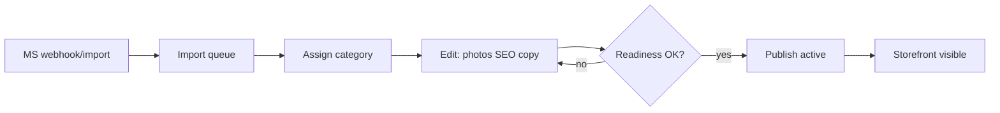
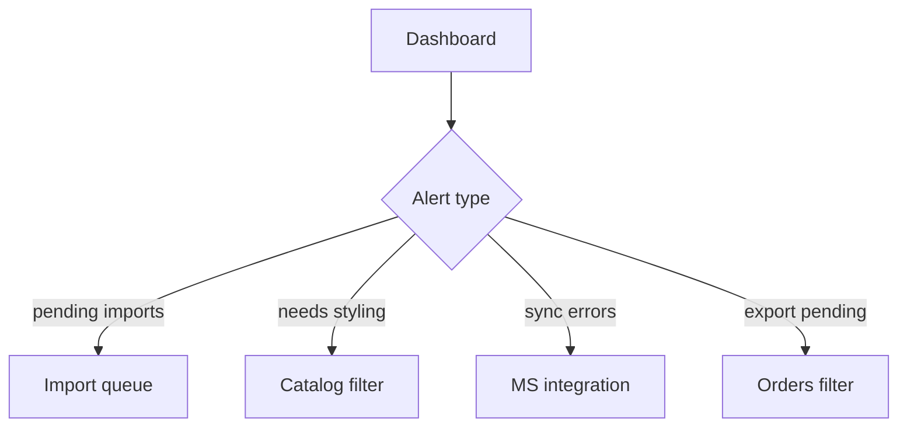

# Admin IA v2 — Phase 1

**Date:** 2026-08-11  
**Status:** Phase 1 architecture (docs only — no application code)  
**Scope:** Information architecture and operator journeys for Admin UX v2  
**Sources:** `docs/ux/admin-ux-audit.md`, ADR-007/010/011/012/013/014, `apps/web/src/lib/admin/navigation.ts`  
**Plan reference:** `.cursor/plans/admin_ux_orchestration_5a14290e.plan.md` (orchestration phases 1–12)

---

## Executive summary

Admin UX v2 is an **evolution**, not a rewrite. Waves 8–14 and Visual Redesign Phases A/B/C already delivered shell, `AdminDataTable`, saved views, command palette, bulk jobs, MS guards, and gallery color coverage.

Phase 1 defines the **target IA**, **operator journeys**, and **screen responsibilities** so Phases 2–12 can ship shared primitives and page upgrades without re-litigating navigation.

**Backend blocking gaps:** none. Reuse existing `/api/v1/admin/*` (confirmed in Phase 0 audit).

**ADR action:** draft amendment to ADR-012 for sidebar label/order changes and the «Оформление» workflow lane (see §8).

---

## Design principles

1. **Workflow-first** — primary loop is MS import → category assign → merchandising edit → publish → storefront visibility.
2. **Action-first queues** — problem + count + primary CTA, not navigation-only boards.
3. **Reuse before create** — extend `AdminDataTable`, saved views, bulk jobs, readiness helpers; do not rebuild parallel systems.
4. **MS ownership explicit** — field-local lock labels, not only page-level banners (GAP-06).
5. **URLs stable** — reorder/rename sidebar labels in Phase 3; do not break bookmarks or E2E paths.
6. **No new summary APIs** — compose dashboard/workflow counts from existing overview endpoints (ADR-012).

---

## Target sidebar IA (v2)

Current implementation: `apps/web/src/lib/admin/navigation.ts`.

### v2 structure

| Section | Order | Item | URL (unchanged) | Change from today |
|---------|-------|------|-----------------|-------------------|
| — | 1 | Сводка | `/admin` | — |
| **Витрина** | 2 | Товары | `/admin/catalog?all=1` | — |
| **Витрина** | 3 | Оформление | `/admin/catalog/workflow` | Keep; evolve board → action queue (Phase 6) |
| **Витрина** | 4 | Категории | `/admin/catalog/categories` | — |
| **МойСклад** | 5 | Синхронизация | `/admin/integrations/moysklad` | Rename from «Интеграция» |
| **МойСклад** | 6 | Импорт | `/admin/integrations/moysklad/import` | Rename from «Очередь импорта» |
| **Операции** | 7 | Заказы | `/admin/orders` | **Move above Склад** (TZ §7, GAP-14) |
| **Операции** | 8 | Склад | `/admin/inventory` | Move below Заказы |
| **Операции** | 9 | Клиенты | `/admin/customers` | — |

**Not in sidebar (by design):** sync trigger/pull/stock actions stay **inside** integration screens — already true; do not add global sync buttons to nav.

**Command palette (`Cmd/Ctrl+K`):** remains global shortcut layer; extend command list only when a screen action lacks a nav entry (Phase 12 polish).

---

## Screen map

```
/admin                          Dashboard — KPI + «Требует внимания» (Action Center)
/admin/catalog                  Category landing OR product list (?all=1, filters)
/admin/catalog/workflow         Merchandising lanes → evolving action queue
/admin/catalog/categories       Category CRUD tree
/admin/catalog/[id]/edit        Product merchandising editor (highest-value screen)
/admin/catalog/new              Redirect → MoySklad (MS-only create)
/admin/integrations/moysklad    Sync status, pull, logs, resync
/admin/integrations/moysklad/import   Import queue (action-first reference)
/admin/inventory                Stock list (variant/product group, read-only MS)
/admin/orders                   Orders list + export-pending filter
/admin/orders/[orderNumber]     Order detail + MS export
/admin/customers                Customers list
/admin/login                    Auth (no panel chrome)
```

### Screen responsibilities

| Screen | Primary operator question | Must surface | Phase |
|--------|---------------------------|--------------|-------|
| Dashboard | «What needs my attention now?» | Clickable KPIs + conditional alert list | 4 (polish GAP-13) |
| Catalog list | «Which products match this filter?» | Saved views, bulk toolbar, stock column, quick visibility | 5 |
| Workflow | «What is blocked and what do I do next?» | Problem + CTA per lane (not links only) | 6 |
| Import queue | «Which MS items need category/publish?» | Checklist, bulk assign/publish jobs | exists; extend toolbar Phase 2 |
| Product edit | «Can I publish this item safely?» | Readiness panel, next item, unsaved guard, preview | 7 |
| Categories | «Is taxonomy correct?» | Tree, product counts, delete guards | exists |
| MS integration | «Is sync healthy?» | Status, errors, manual pull | exists |
| Inventory | «What is low/out of stock?» | Read-only MS, grouped views | 10 parity |
| Orders | «What must ship/export?» | Export-pending tab, status badges | 10 |
| Customers | «Who are wholesale/retail?» | Search; saved views if API allows | 10 |

---

## Operator journeys

### Journey A — New MS product → storefront



**IA touchpoints:** Import → Edit (with `?from=` context) → optional Preview (see ecommerce architecture EUX-011) → Publish.

**Gaps blocking speed (P1):** GAP-01 readiness on edit, GAP-02 proactive blockers, GAP-03 next product, GAP-04 unsaved guard.

### Journey B — Daily attention triage



**Data sources (no new API):** `GET /admin/dashboard/summary`, `GET /admin/catalog/overview`, `GET .../moysklad/status`, `GET /admin/inventory/overview`, `GET /admin/orders?export_pending=true`.

### Journey C — Queue processing at scale (100–300+ items)

1. Open catalog or import with filter (`needs_styling`, `uncategorized`, etc.).
2. Enter edit from row with `from` query preserving list context.
3. Complete merchandising fields; **Save** stays on page (ADR-012).
4. **Next product** advances without returning to list (GAP-03).
5. Repeat until queue empty.

**Context preservation:** extend `catalog-list-url.ts` (`from`, `return_to`) — already used; next-item navigation builds on same filter snapshot.

---

## Shared primitives (Phase 2 target)

Authoritative gap list: `docs/ux/admin-ux-audit.md` §4–5. Phase 1 assigns ownership only.

| Primitive | Action | Wraps / replaces | Gaps |
|-----------|--------|------------------|------|
| `AdminReadinessPanel` | **Create** | `merchandising-readiness.ts` | GAP-01, GAP-02 |
| `AdminNextItemNavigation` | **Create** | filtered `GET .../products` + `from` URL | GAP-03 |
| `useAdminUnsavedGuard` | **Create** | edit form dirty state | GAP-04 |
| `AdminSyncedField` | **Create** | muted `readOnlyClass` divs | GAP-06 |
| `AdminStatusBadge` | **Create** | ad-hoc Badge usage | GAP-10 |
| `AdminBulkToolbar` | **Generalize** | `AdminCatalogBulkToolbar` + import toolbar | GAP-11 |
| `AdminFilterBar` | **Compose** | `AdminSavedViews` + `AdminFilterChips` + `AdminSearchBar` | — |
| Section nav (edit) | **Create** | sticky save bar companion | GAP-07 |

**Do not rebuild:** `AdminDataTable`, command palette shell, `AdminBulkJobProgress`, gallery color tagging core, MS banner, mobile drawer.

---

## Workflow board → action queue (Phase 6 direction)

**Today:** `AdminWorkflowBoard` — 8 lanes with counts linking to filtered catalog/import views.

**Target:** same lanes as **saved-view entry points**, but primary surface shows:

| Column | Content |
|--------|---------|
| Problem | Human-readable blocker (e.g. «Нет категории», «Нет фото по цветам») |
| Count | From `GET /admin/catalog/overview` |
| Primary CTA | «Открыть очередь» → pre-filtered list OR inline bulk action where safe |
| Secondary | Deep link to docs/runbook if MS sync error |

**Reuse:** catalog list APIs, import queue bulk jobs (`POST /admin/jobs/bulk`), existing overview counts — **no** `workflow-summary` API (stale proposal; superseded by ADR-012).

---

## Product edit — target layout (Phase 7)

```
┌─────────────────────────────────────────────────────────────┐
│ AdminPageHeader + contextual back (return_to)               │
├─────────────────────────────────────────────────────────────┤
│ AdminReadinessPanel (sticky on desktop)                     │
├──────────────┬──────────────────────────────────────────────┤
│ Gallery      │ Основное: name, description, category, SEO   │
│ (left col)   │ AdminSyncedField blocks for MS-owned prices  │
├──────────────┤ Варианты (read-only MS stock/SKU)           │
│ Color matrix │ MoySklad banner (policy once)                │
├──────────────┴──────────────────────────────────────────────┤
│ Sticky section nav (mobile chips) + sticky save bar         │
│ AdminNextItemNavigation                                   │
└─────────────────────────────────────────────────────────────┘
```

**Preview link:** depends on storefront draft preview architecture — see `docs/ux/ecommerce-ux-v2-architecture.md` §Draft preview (EUX-011). Until backend ships, keep current «after publication» fallback with explicit IA note.

---

## RBAC and visibility (unchanged)

- Sidebar: `filterAdminNavSections(permissions)` — keep.
- Write actions: `catalog:write`, `orders:write`, `inventory:write`, `customers:read` — no IA change.
- Viewer role: hide write columns/toolbars (already implemented).

---

## Backend policy (Phase 1)

| Candidate | Verdict |
|-----------|---------|
| `publish_blockers` on GET product | Optional later — FE mirror sufficient for Phases 2–7 |
| Next-in-queue API | **Defer** — FE filtered list + stable sort |
| `workflow-summary` API | **Do not build** |
| Bulk hide/show jobs | Defer unless 20+ row selections are routine |
| Event timeline | Defer (GAP-18) |

---

## Phase mapping (implementation)

| Phase | Focus | Gaps | Depends on |
|-------|-------|------|------------|
| **1** | This IA doc + ADR-012 amendment draft | GAP-14 | Phase 0 audit |
| **2** | Shared primitives shells | GAP-01/03/06/10/11 | IA approval |
| **3** | Shell — sidebar rename/reorder, page headers | GAP-09, GAP-14 | Phase 2 badges optional |
| **4** | Dashboard Action Center polish | GAP-13 | — |
| **5** | Catalog list bulk/quick-edit | GAP-11, GAP-12 | Phase 2 toolbar |
| **6** | Workflow → action queue | GAP-05 | Overview APIs |
| **7** | Product editor | GAP-01–04, GAP-06–07 | Phase 2 primitives |
| **8** | Gallery color matrix | GAP-08 | Readiness panel |
| **9** | Variants MS display | GAP-06 | AdminSyncedField |
| **10** | Orders/inventory/customers parity | GAP-16 | AdminStatusBadge |
| **11** | Mobile edit IA | GAP-15 | Section nav |
| **12** | Polish, a11y, E2E expansion | GAP-17 | Each phase gate |

**Deferred:** GAP-18 event timeline, TipTap descriptions, user-persisted saved views DB.

---

## ADR-012 amendment draft

**Proposed additions** (for `docs/adr/ADR-012-admin-panel-ia.md` or ADR-012 amendment file):

1. **Sidebar v2 labels and Operations order** — Заказы before Склад; МойСклад «Синхронизация» / «Импорт» labels.
2. **«Оформление» workflow lane** — document as first-class merchandising entry (already in code; not in original ADR table).
3. **Product edit primitives** — ReadinessPanel, NextItemNavigation, unsaved guard as standard merchandising editor affordances (implementation Phase 7).
4. **Action-first workflow** — workflow board may evolve from link board to queue without new backend endpoints.

**Status:** draft in this doc; formal ADR acceptance required before Phase 3 nav merge.

---

## Cross-surface: storefront

Ecommerce-wide UX depends on admin merchandising speed. Do **not** duplicate admin findings in the storefront architecture doc.

| Storefront need | Admin owner | Doc |
|-----------------|-------------|-----|
| Draft preview before publish | Product edit + public preview route | `ecommerce-ux-v2-architecture.md` EUX-011 |
| Merchandising loop | Import → edit → publish | This doc Journey A |
| Publish readiness rules | Shared `merchandising_readiness.py` | admin-ux-audit §1.4 |

---

## E2E gates (add when features ship)

Existing: 16 admin specs through Wave 7 + palette/RBAC smokes (see admin-ux-audit §7).

**Must add:**

| Feature | Spec focus |
|---------|------------|
| Readiness on edit | Panel visible; links anchor sections |
| Next product | `from` filter preserved; advances ID |
| Unsaved guard | `beforeunload` + cancel confirm |
| Workflow queue CTA | Lane CTA opens correct filter |
| Mobile edit | Section nav visible @390px |

---

## Phase 1 exit criteria

- [x] Target sidebar IA documented with URL stability policy
- [x] Screen map and operator journeys defined
- [x] Primitive ownership mapped to audit GAPs
- [x] ADR-012 amendment draft included
- [x] Backend reuse/defer policy restated
- [x] Cross-reference to storefront preview architecture
- [ ] User approval before Phase 2 UI code

---

## Related

| Resource | Path |
|----------|------|
| Phase 0 audit | `docs/ux/admin-ux-audit.md` |
| ADR-012 | `docs/adr/ADR-012-admin-panel-ia.md` |
| Navigation source | `apps/web/src/lib/admin/navigation.ts` |
| Storefront architecture | `docs/ux/ecommerce-ux-v2-architecture.md` |
| Stale 2026-07-22 plan | `docs/reviews/ADMIN-PANEL-UX-IMPROVEMENT-PLAN-2026-07-22.md` (historical; P0/quick wins shipped) |
