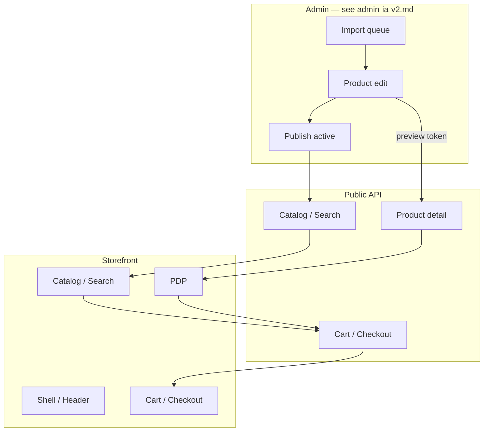

# ECOMMERCE UX V2 Architecture — Phase 1

**Date:** 2026-08-11  
**Status:** Phase 1 architecture (docs only — no application code)  
**Scope:** Storefront UX V2 target architecture + cross-surface merchandising integration  
**Sources:** `docs/ux/ecommerce-ux-audit.md`, Mobile Wave 4/5 reviews, stich.su parity doc, ADR-004/010/011  
**Plan reference:** `.cursor/plans/ecommerce_ux_v2_bdc2c25c.plan.md` (phases 2–16 implementation)

---

## Executive summary

ECOMMERCE UX V2 is an **incremental hardening** of the existing storefront and shared design system — not a visual redesign. Catalog, variants, color gallery, filters, cart, checkout foundation, and admin Waves 8–14 already exist.

Phase 1 architecture resolves **open design decisions** from the Phase 0 audit (EUX-001–EUX-014), defines **storefront information architecture**, and **imports the admin merchandising track by reference** without duplicating admin findings.

**Release gate (parallel):** YooKassa payment integration (ADR-004) blocks checkout UX completion (EUX-001). UX V2 Phases 7+ must not claim checkout done until YooKassa ships.

---

## Principles

1. **Extend, do not fork** — one Tailwind/shadcn foundation (`globals.css`, `site-config.ts`, `components/ui/*`).
2. **Factual content only** — no fake marketing copy, placeholder contacts, or invented delivery terms (EUX-002, EUX-004, EUX-005).
3. **Admin owns display layer** — MoySklad owns prices/stock/SKU (ADR-010); storefront reflects admin merchandising output.
4. **Dedupe mobile work** — Wave 5 fixes are prerequisites; Wave 6 backlog reconciled here, not duplicated (see §Mobile).
5. **Admin track by reference** — admin-only gaps live in `docs/ux/admin-ux-audit.md` and `docs/ux/admin-ia-v2.md` (EUX-012).
6. **Optional hero/content** — homepage promos/hero only when real approved assets exist (audit §Home).

---

## System context



---

## Storefront information architecture

### Existing routes (keep)

| Route | Purpose | Primary components |
|-------|---------|-------------------|
| `/` | Homepage sections | `SectionTabs`, `SeoContentBlock` |
| `/catalog` | All products PLP | `FilteredProductList`, filters |
| `/catalog/[slug]` | Category PLP | same + category context |
| `/products/[slug]` | PDP | `ProductDetail`, gallery, variants |
| `/search` | Search results | `CatalogSearchForm`, `ProductGrid` |
| `/cart` | Cart review | `CartClient` |
| `/checkout` | Shipping + payment | `CheckoutShippingForm`, payment client |
| `/checkout/confirmation` | Order confirmation | `ConfirmationClient` |
| `/account`, `/account/orders/*` | Account (flag-gated) | profile + order history |
| `/offline` | PWA offline | static |

### New routes (Phase 3 — static-first)

**Decision:** informational pages ship as **static Next.js App Router pages** with content in `site-config.ts` or colocated markdown/TS modules — **not** admin-managed CMS in UX V2 scope.

| Route | Purpose | Content source | Blocker |
|-------|---------|----------------|---------|
| `/delivery` | Delivery terms | Business-approved copy in repo | Real copy from ops/legal |
| `/payment` | Payment methods | YooKassa + cash-on-delivery facts post ADR-004 | YooKassa gate |
| `/returns` | Returns policy | Business-approved copy | Real copy |
| `/contacts` | Phone, email, address | Replace `site-config.ts` placeholders | Real contacts |
| `/about` | Company summary | Optional; link from footer | Real copy |

**Wire-up:** Phase 3 updates `site-config.ts` `topBar.links`, `footer.columns`, and contact fields to point to these routes. Until copy exists, show honest «страница готовится» stub — **not** redirect to `/catalog`.

### Header / footer IA (target)

**Desktop (compact target — Phase 3):**

- Row A (optional): slim trust/contact strip — phone, delivery link, wholesale CTA.
- Row B: logo | search | account | cart.
- Row C: category nav (API-driven mega menu).

**Mobile (Phase 3 + Wave 6 reconciliation):**

- Single compact row: menu | logo | cart; search as icon → expandable field or dedicated overlay.
- Trust/contact: footer + «Покупателю» hub (`/delivery`, `/returns`, `/contacts`) — not duplicated top bar.
- Bottom nav: keep route-aware hide rules (`/cart`, `/checkout*`, PDP sticky per Wave 5).

---

## Design system policy

### Tokens and config (extend only)

| Layer | Location | Policy |
|-------|----------|--------|
| CSS tokens | `apps/web/src/app/globals.css` | Add storefront status/empty-state tokens if needed; no new palette |
| Site copy | `apps/web/src/lib/store/site-config.ts` | Single source for contacts, trust bar, footer |
| Grid/layout | `site-config.ts` `gridClasses` | PLP card ratio change (4:5) documented here, implemented Phase 5 |
| shadcn | `components/ui/*` | Prefer composition over new primitives |
| Store components | `components/store/**` | Feature folders: `layout/`, `catalog/`, `checkout/` |

### New storefront shared components (Phase 2)

| Component | Purpose | Audit |
|-----------|---------|-------|
| `StoreEmptyState` | Zero results, empty cart messaging | EUX-013 |
| `StoreErrorState` | Retryable fetch failures | EUX-013 |
| `StoreSkeleton*` | PLP/PDP/cart loading | EUX-013 |
| `StoreStatusBadge` | Stock/sale states on cards | EUX-008 |
| `ProductCard` ratio | 4:5 image area | EUX-008 |

**Admin primitives** (`AdminReadinessPanel`, etc.) are defined in `docs/ux/admin-ia-v2.md` — not duplicated here.

### Typography / spacing rules

- Minimum touch target 44px on mobile (Wave 5 baseline).
- PLP grid: keep existing responsive columns; adjust aspect ratio before changing column count.
- PDP: preserve gallery + purchase panel split; mount specs/trust blocks below fold (Phase 6).

---

## Page architectures

### Homepage (Phase 4)

**Keep:** API-backed `SectionTabs` (recommendations, new, sale) + `SeoContentBlock`.

**Optional:** `homepagePromos` / hero — **only** when marketing provides real images/copy. No placeholder hero.

### Catalog / search (Phase 5)

- Filters: continue URL-synced server-side facets (already superior to stich full reload).
- Category fallback policy (EUX-009): **production** prefers empty/error state over hardcoded taxonomy when API fails; dev/offline may keep static fallback with visible disclaimer.
- Product card: move to 4:5 aspect after photo audit; binary stock badge unless low-stock API added.

### PDP (Phase 6)

**Content section order (top → bottom):**

1. Breadcrumbs
2. Gallery + purchase panel (variants, price, CTA)
3. Selected variant summary line («Размер: 42», stock state)
4. Description (real only — **remove fake tactical fallback**, EUX-004)
5. Characteristics (`ProductSpecsTable` when data exists)
6. Delivery / returns **factual** snippets linking to `/delivery`, `/returns`
7. Trust/consultation block (only verified claims from `trustBar` / contacts)
8. Related products (existing)

**Empty description:** show operator-facing hint in admin readiness; storefront shows «Описание уточняется» or omits block — never generated marketing text.

### Cart / checkout (Phase 7)

**Cart line model (target):**

| Field | Source |
|-------|--------|
| Image | Extend cart snapshot with `image_url` or resolved thumbnail URL |
| Title | `product_snapshot.name` |
| Variant | Structured attributes (not raw SKU for retail) |
| Price | Snapshot unit price in **RUB** |
| Qty | Existing controls |
| Remove | Existing |

**Currency:** enforce `RUB` from product/session; remove `USD` fallback in UI.

**Checkout:** payment UI and copy follow ADR-004 YooKassa flow when gate completes. Until then, UX V2 documents provider mismatch (EUX-001) but does not polish Stripe/stub as final.

### Search (Phase 3)

**UX target:** typeahead in header with debounce; groups:

- Products (name/SKU match)
- Categories (name match)
- «Все результаты» → `/search?q=`

**API options (pick one in Phase 3 implementation):**

| Option | Pros | Cons |
|--------|------|------|
| A. FE-only debounced calls to existing `/products/search` + `/categories` | No backend | Two requests; category match client-side |
| B. New `GET /products/suggest?q=&limit=` | Single fast endpoint | Backend work |

**Recommendation:** Option B for production; Option A acceptable for prototype behind feature flag.

---

## Cross-surface: admin merchandising (import by reference)

Admin findings are **authoritative** in `docs/ux/admin-ux-audit.md`. IA and journeys: `docs/ux/admin-ia-v2.md`.

### Ecommerce dependency map

| Storefront outcome | Admin capability | Admin gap IDs |
|--------------------|------------------|---------------|
| Correct published PDP | Edit + publish readiness | GAP-01, GAP-02 |
| Fast queue throughput | Next item + unsaved guard | GAP-03, GAP-04 |
| Color-accurate gallery | Color matrix + gallery | GAP-08 |
| Preview before publish | Draft preview (below) | EUX-011 |
| Operator finds blocked SKUs | Workflow action queue | GAP-05 |

**Implementation ownership:** Admin UX v2 Phases 2–8. Storefront Phases 8–13 track progress via admin phases — no duplicate tasks in storefront TASKS.

---

## Draft storefront preview (EUX-011)

**Problem:** Public `GET /products/{slug}` returns `active` only; admin edit links to live PDP only after publish.

**Decision:** signed **preview token** route (recommended).

```
GET /products/[slug]?preview=<token>
```

| Aspect | Policy |
|--------|--------|
| Auth | Token issued to authenticated admin with `catalog:read`; short TTL (e.g. 15 min) |
| Data | Renders draft merchandising overlay (name, description, gallery, SEO) without changing public listing |
| Visibility | `noindex,nofollow`; banner «Предпросмотр» on storefront |
| MS rules | Still read-only MS fields; preview shows merged admin display layer |
| Alternative rejected | Public bypass of `status=active` filter without token — visibility leak risk |

**Backend:** new preview token endpoint or admin-scoped BFF; cache headers `private, no-store`.

**Frontend:** product edit «Предпросмотр» opens new tab with token; disabled when slug missing.

---

## API architecture summary

| Need | Phase | Backend | OpenAPI |
|------|-------|---------|---------|
| Cart line image | 7 | Extend cart snapshot schema | yes |
| Search suggest | 3 | Optional new suggest endpoint | yes |
| Draft preview | 8 | Preview token + detail renderer | yes |
| Low-stock public state | 5 (optional) | Derived boolean on variant/product | yes |
| YooKassa checkout | 7 | ADR-004 release gate | yes |

Full gap matrix: `docs/ux/ecommerce-ux-audit.md` §API Gap Matrix.

---

## Mobile reconciliation (Wave 5 / 6)

Do not open a parallel mobile epic. Disposition:

| Topic | Owner | Action |
|-------|-------|--------|
| Checkout CSP blank (MOB-001) | Wave 5 | Verify deployed; prerequisite for checkout QA |
| PDP sticky overlap (MOB-002) | Wave 5 | Verify; then PDP summary UX (EUX-010) |
| Touch targets (MOB-003+) | Wave 5 | Verify; don't re-audit |
| Compact header (MOB-012) | Wave 6 / EUX-007 | Implement in Phase 3 shell |
| Auth route bottom nav (MOB-013) | Wave 6 | Hide bottom nav on auth routes |
| Viewport matrix (EUX-014) | Phase 14 | Expand Playwright projects |

Evidence screenshots listed in audit §Existing Visual Evidence — reuse for before/after, do not re-capture blindly.

---

## Visual QA matrix (Phase 14)

| Viewport | Width | Priority journeys |
|----------|-------|-------------------|
| Mobile S | 375 | Home, PLP, PDP sticky, cart, checkout |
| Mobile M | 390 | Same (CI default) |
| Mobile L | 430 | PLP filters sheet |
| Tablet | 768, 1024 | Catalog filters, admin edit (cross-surface) |
| Desktop | 1280, 1440, 1920 | Header, mega menu, PDP gallery |

**CI policy:** keep `mobile-chrome` @390; add optional `desktop-wide` project for regression nights — not every PR.

**Datasets:** products with multi-color gallery, sale price, OOS variant, missing description, MS-only ERP image.

---

## Implementation phases (2–16)

Maps audit §Phase Mapping Recommendation to concrete exit criteria.

| Phase | Name | Key deliverables | Audit IDs |
|-------|------|------------------|-----------|
| **1** | Architecture | This document + admin-ia-v2 | EUX-* triage |
| **2** | Design system | Store empty/error/skeleton; card ratio policy | EUX-013, EUX-008 |
| **3** | Storefront shell | Info routes, header mobile/desktop, search suggest UX | EUX-002, EUX-006, EUX-007 |
| **4** | Home | Section tabs polish; hero only if real content | — |
| **5** | Catalog | 4:5 cards, fallback policy, optional low-stock | EUX-008, EUX-009 |
| **6** | PDP | Real description policy, specs, trust/delivery blocks | EUX-004, EUX-005, EUX-010 |
| **7** | Cart/checkout | Cart images, RUB, YooKassa UI | EUX-001, EUX-003 |
| **8–13** | Admin integration | Track admin-ia-v2 phases 2–8 | EUX-011, EUX-012 |
| **14** | Mobile QA | Viewport matrix, Wave 5/6 verification | EUX-014 |
| **15** | a11y/perf | Focus order, image loading, RSC boundaries | — |
| **16** | Final audit | Journey verification vs Phase 0 baseline | — |

---

## Findings disposition (EUX-001–EUX-014)

| ID | Severity | Phase 1 decision |
|----|----------|------------------|
| EUX-001 | P0/P1 | Blocked on YooKassa gate; no Stripe polish as final |
| EUX-002 | P1 | Static info routes + real `site-config` contacts |
| EUX-003 | P1 | Cart snapshot image + hide retail SKU |
| EUX-004 | P1 | Remove fake PDP description fallback |
| EUX-005 | P1 | PDP section order + factual delivery/returns links |
| EUX-006 | P1 | Suggest UX; prefer `/products/suggest` API |
| EUX-007 | P1 | Compact mobile header; Wave 6 items merged |
| EUX-008 | P2 | 4:5 ratio after photo audit |
| EUX-009 | P2 | Production honest empty over static taxonomy |
| EUX-010 | P2 | Selected variant summary line |
| EUX-011 | P1 | Signed preview token architecture |
| EUX-012 | P1 | Admin track imported — see admin-ux-audit |
| EUX-013 | P2 | Shared store empty/error/skeleton Phase 2 |
| EUX-014 | P2 | QA matrix § above |

---

## Dependencies and release gates

| Dependency | Blocks | Owner |
|------------|--------|-------|
| YooKassa (ADR-004) | Checkout UX complete, `/payment` page copy | checkout-specialist |
| Real business copy | Contacts, delivery, returns pages | ops/legal |
| Admin Phase 7 | Preview + publish confidence | admin UX v2 |
| Mobile Wave 5 deploy | Checkout/mobile QA baseline | devops |
| `MEDIA_PUBLIC_BASE_URL` | Gallery/cart images on prod | ops |

---

## Out of scope (UX V2)

- Wishlist, reviews, coupons, loyalty, comparison, AI recommendations (audit dedupe).
- Admin-managed CMS for info pages.
- TipTap rich descriptions (deferred in TASKS).
- New parallel component library or rebrand.

---

## Phase 1 exit criteria

- [x] Storefront IA with new static info routes decided
- [x] Design system extend-only policy documented
- [x] PDP/cart/search/checkout target architectures defined
- [x] Draft preview architecture decided (signed token)
- [x] Admin track imported by reference (no duplicated GAP list)
- [x] Mobile Wave 5/6 reconciliation documented
- [x] Phases 2–16 mapped to audit findings
- [ ] User approval before Phase 2 code

---

## Related

| Resource | Path |
|----------|------|
| Phase 0 audit | `docs/ux/ecommerce-ux-audit.md` |
| Admin IA v2 | `docs/ux/admin-ia-v2.md` |
| Admin Phase 0 audit | `docs/ux/admin-ux-audit.md` |
| YooKassa decision | `docs/adr/ADR-004-yookassa-final-payment-integration.md` |
| Variant UX | `docs/adr/ADR-011-variant-selector-ux.md` |
| Mobile synthesis | `docs/reviews/MOBILE-UX-WAVE4-SYNTHESIS-2026-08-08.md` |
| Production URLs | `.cursor/VERIFICATION.md` |
